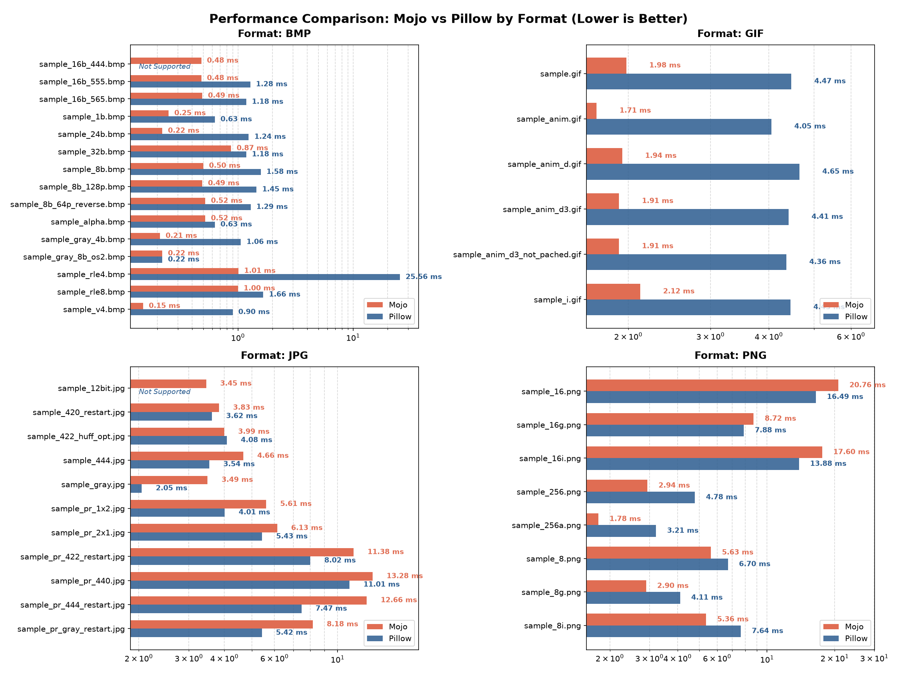

# Mojo Image Reader Library Benchmark Suite

A benchmarking and performance comparison repository, designed to measure and visualize the execution speed of the Mojo-native [image reading library](https://github.com/AlexALX/mojo-image-reader) against Python's `Pillow`.

---

## Overview

This repository contains the benchmarking harness, sample test images, and visualization scripts used to evaluate decoding speeds across various formats (**BMP**, **GIF**, **JPEG**, and **PNG**). It compiles a high-performance Mojo benchmark, logs execution medians, and automatically generates clear, grouped comparison charts.

[](results/benchmark_comparison.png)

---

## Project Structure

```text
├── benchmark/            # Mojo benchmark source files
├── samples/              # Test sample images categorized by format
├── imagelib/             # Submodule of the Mojo image library under test
├── log.txt               # Raw output logs generated by the benchmark runner
├── bench_graph.py        # Python script to parse logs and generate the comparison chart
├── run_bench.sh          # Shell script executing individual file benchmarks
└── pixi.toml             # Pixi package manager and task runner configuration
```

## Requirements & Environment

This project uses **Pixi** for fully reproducible environment management, locking the **Mojo 1.0** toolchain and required Python packages (`pandas`, `matplotlib`).

1. Install [Pixi](https://pixi.sh/):
   `curl -fsSL https://pixi.sh/install.sh | bash`
2. Install dependencies:
   `pixi install`

---

## Usage

You can run the complete pipeline compiling the benchmark, executing tests across all samples, and generating the performance chart with a single command:
`pixi run all`

### Individual Tasks

If you want to run specific steps manually:

* **Compile the benchmark:** `pixi run build`
* **Run benchmarks and update `log.txt`:** `pixi run bench`
* **Generate the comparison chart (`benchmark_comparison_grouped.png`):** `pixi run plot`

---

## Output Chart

The generated `benchmark_comparison_grouped.png` features:
* **Grouped subplots** by image format (BMP, GIF, JPG, PNG).
* **Logarithmic scale** to accommodate a wide range of execution times.
* **Error handling:** Formats or features not supported by either library are cleanly labeled as `Not Supported` with empty timelines.

## Samples

* All sample images used in this benchmark suite are my personal photographs from my archive.
* PNG images generated using my script in Blender (the source script is included).
* Also included are the .xcf (GIMP) source files for GIFs and a custom patcher script for disposal method 3.

---

## License

* **Scripts and Code:** Licensed under the [Apache 2.0 License](LICENSE).
* **Samples and Media:** Licensed under the [Creative Commons Attribution 4.0 International (CC BY 4.0)](https://creativecommons.org/licenses/by/4.0/). You are free to share and adapt the media, provided you give appropriate credit to the author.